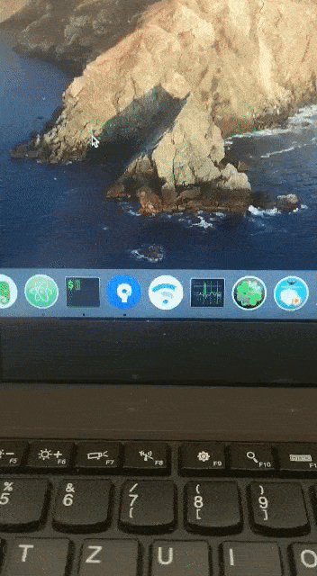

# ThinkPad T450s Big Sur OpenCore 0.6.6

## Introduction to the

- This is a full ThinkPad T450s macOS Big Sur + DW1820a configuration.
- Sound card default Layout-id = 32, earphone noise please use the sound card repair script(ALCPlugFix).
- Support touch screen (With multi-touch and touchscreen gestures).
- support Catalina.
- support ThinkPad X250 ThinkPad T450.

## Hardware information

```  
- CPU：Intel Core i7-5600U 2.6GHz (Boots 3.2GHz)

- The core graphics：Intel HD 5500 Graphics 

- sound card：ALC292

- Wireless network card：DW1820A
```

# ThinkPad Assistant 
- Allows you to use all function keys on Thinkpad T450s X250 T450 laptop.
- Copy the ThinkpadAssistant into the Application folder.
- Start ThinkpadAssistant and check "Start when logged in" in the menu bar.
- F4: Mute / Unmute Microphone (with Status LED indication).
- F7: Screen mirroring / Screen extending.
- F8: Activate / Deactivate Wi-Fi.
- Left Shift+F8: Activate / Deactivate Bluetooth.
- F9: Open System Preferences.
- F12: Open Launchpad.
- FN+Space: Toggle Keyboard Backlight.
- FN + 4: Sleep shortcut.
  (press the sleep shortcut again during sleep to terminate sleep).
  (When an external monitor is connected, after pressing the sleep button, the working screen changes to an external monitor (the internal screen is turned off); pressing the sleep button again, the internal and external monitors return to normal.)
- PrtSc maps to F13: this can be set as screenshot in system preferences -> keyboard -> shortcut.
-----------------------------------------------------------------------------------------------------------------


## BIOS (1.37)
-  Security -> Security Chip`: **Disabled**;
-  Memory Protection -> Execution Prevention`: **Enabled**;
-  Virtualization -> Intel Virtualization Technology`: **Enabled**;
-  Internal Device Access -> Bottom Cover Tamper Detection`: must be **Disabled**;
-  Anti-Theft -> Current Setting`: **Disabled**;
-  Anti-Theft -> Computrace -> Current Setting`: **Disabled**;
-  Secure Boot -> Secure Boot`: **Disabled**;
-  UEFI/Legacy Boot`: **UEFI Only**;
-  CSM Support`: **Yes**.

## Effective
- CPU
- Sleep/Wake up
- Wifi
- Bluetooth
- Handoff, Continuity, AirDrop
- iMessage, FaceTime, App Store, iTunes Store
- Ethernet card
- sound card
- USB
- The battery
- touch screen
- touch pad
- little red dot
- miniDP
- SD card reader

## Invalid
- VGA
- The fingerprint
