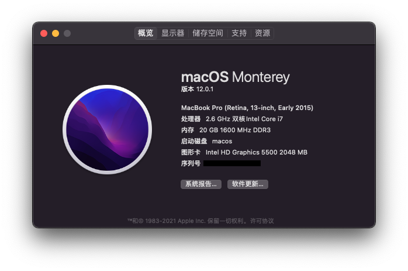

# ThinkPad T450s Big Sur OpenCore 6.1

## 简介
- 这是一个完整的ThinkPad T450s macOS Big Sur + DW1820a 配置。
- 使用DW1820A安装系统时无需在BIOS中禁用WIFI。 
- 声卡默认 layout-id = 32，耳机杂音请使用声卡修复脚本(ALCPlugFix)。 
- 支持触摸屏 
- (PS:如果不想ACPI补丁在其它系统中生效，请在opencore configurator 偏好设置中将版本改成MOD分支版然后保存即可。)

## 硬件信息

```  
- CPU：Intel Core i7-5600U 2.6GHz (Boots 3.2GHz)

- 核心显卡：Intel HD 5500 Graphics 

- 声卡：ALC292

- 无线网卡：DW1820A
```

## BIOS (1.37)
-  Security -> Security Chip`: **Disabled**;
-  Memory Protection -> Execution Prevention`: **Enabled**;
-  Virtualization -> Intel Virtualization Technology`: **Enabled**;
-  Internal Device Access -> Bottom Cover Tamper Detection`: must be **Disabled**;
-  Anti-Theft -> Current Setting`: **Disabled**;
-  Anti-Theft -> Computrace -> Current Setting`: **Disabled**;
-  Secure Boot -> Secure Boot`: **Disabled**;
-  UEFI/Legacy Boot`: **UEFI Only**;
-  CSM Support`: **Yes**.

## 有效
- CPU
- 睡眠/唤醒
- Wifi
- 蓝牙 
- Handoff, Continuity, AirDrop
- iMessage, FaceTime, App Store, iTunes Store
- 以太网卡
- 声卡
- USB
- 电池
- 触摸屏 
- 触摸板 
- 小红点
- miniDP
- SD卡读卡器

## 无效
- VGA
