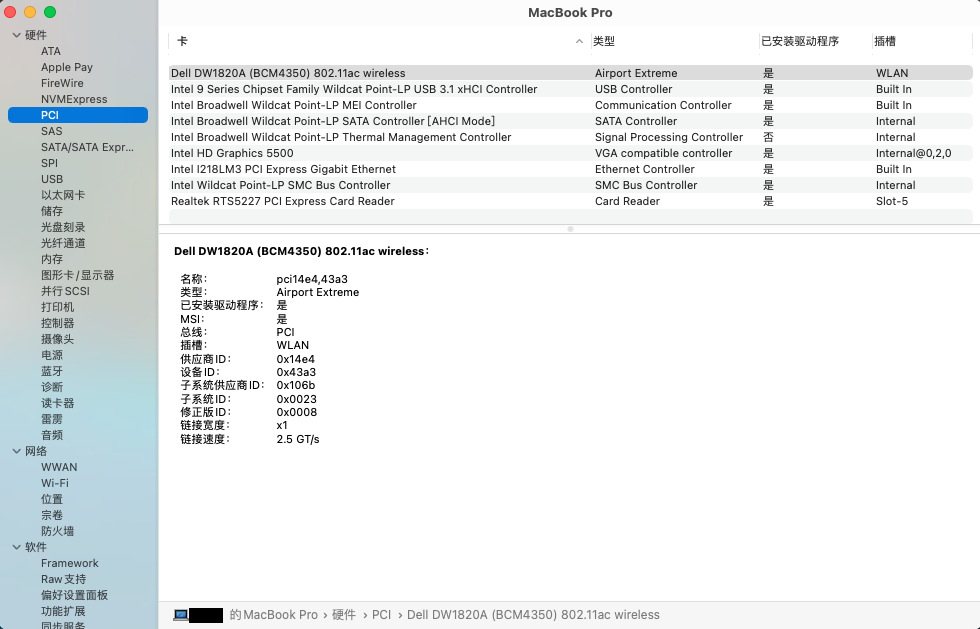
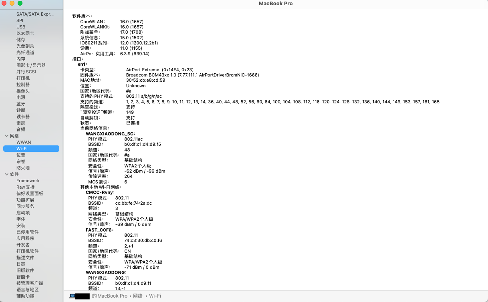
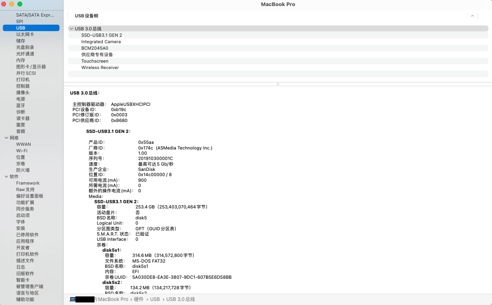

# Thinkpad T450s Big Sur Bate3

## 简介
- 这是一个完整的Thinkpad T450s macOS Big Sur + DW1820a 配置
- 使用DW1820A安装系统时无需在BIOS中禁用WIFI
- 默认使用fakeSMC 安装完成后可以替换为virtualSMC 
- 声卡默认 layout-id = 15 解决耳机杂音问题 但需要手动选择输入/输出设备 
（内置扬声器+内置麦克风+耳机+耳机麦克风测试正常）
- 触摸板使用VoodooSMBus + VoodooRMI驱动
- 触摸屏使用VoodooI2CHID驱动 但它目前不起作用 正在寻找解决方案



## 硬件信息

```  
- CPU：Intel Core i7-5600U 2.6GHz (Boots 3.2GHz)

- 核心显卡：Intel HD 5500 Graphics 

- 声卡：ALC292

- 无线网卡：DW1820A
```

## BIOS (1.37)
-  Security -> Security Chip`: **Disabled**;
-  Memory Protection -> Execution Prevention`: **Enabled**;
-  Virtualization -> Intel Virtualization Technology`: **Enabled**;
-  Internal Device Access -> Bottom Cover Tamper Detection`: must be **Disabled**;
-  Anti-Theft -> Current Setting`: **Disabled**;
-  Anti-Theft -> Computrace -> Current Setting`: **Disabled**;
-  Secure Boot -> Secure Boot`: **Disabled**;
-  UEFI/Legacy Boot`: **UEFI Only**;
-  CSM Support`: **Yes**.

## 有效
- CPU
- 睡眠/唤醒
- Wifi
- 蓝牙 
- Handoff, Continuity, AirDrop
- iMessage, FaceTime, App Store, iTunes Store
- 以太网卡
- 声卡
- USB
- 电池
- 触摸板 
- 小红点
- miniDP
- SD卡读卡器

## 无效
- 触摸屏 (正在寻找解决方案)
- VGA
